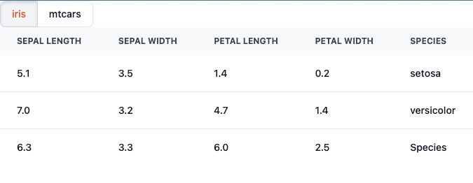
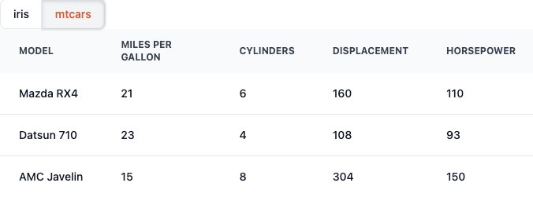

# shinyFlowbiteSvelte

This is a proof of concept demonstrating a Shiny application with a [Svelte](https://svelte.dev/) UI.
The UI was written entirely with Svelte, specifically the [Flowbite Svelte](https://flowbite-svelte.com/) library.
The server just prints to the R console but it demonstrates the Svelte -> Shiny connection.

The app let's you choose either the iris or mtcars datasets and displays a subset of the data.






## Installation

The JavaScript and CSS are bundled to the `www` directory so you can run `app.R` like you would any other Shiny app.
If you make any edits though you'll need to re-bundle before you see the changes.
You can do that like so
```bash
cd srcjs
npm install
npm run build
```
And then run `app.R` like normal.
